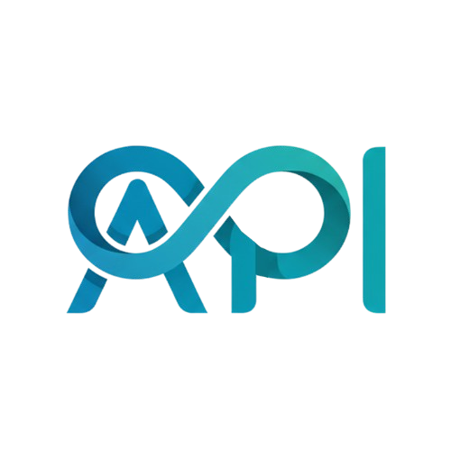

# 🌐 The API Community — Frontend

<div align="center">
  
  <br/>
  <br/>

  <p>
    <strong>The API Community</strong> is India's growing network of API builders, developers, and tech enthusiasts.
    <br/>
    A space to collaborate, explore, and shape the future of APIs.
  </p>

  <p>
    <a href="https://github.com/theapicommindia/frontend-api/stargazers">
      
    </a>
    <a href="https://github.com/theapicommindia/frontend-api/network/members">
      
    </a>
    
    
    
  </p>
</div>

---

## 📸 Pages

| Page | Description |
|---|---|
| **Home** | Hero section, live community stats, join form |
| **About** | Mission, story, and values of the community |
| **Events** | Upcoming and past community events |
| **Speakers** | Featured speakers and industry leaders |
| **Team** | Core team members and contributors |

---

## 🛠 Tech Stack

| Category | Technology |
|---|---|
| **Framework** | React 19 + Vite 7 |
| **Styling** | Tailwind CSS 3 |
| **Animations** | Framer Motion, GSAP, AOS |
| **3D / Canvas** | Three.js, React Three Fiber |
| **Routing** | React Router DOM v7 |
| **Icons** | Lucide React, React Icons |
| **HTTP** | Axios |
| **Notifications** | React Hot Toast |
| **Charts** | Recharts |
| **Text Effects** | Split Type |

---

## 🚀 Getting Started

### Prerequisites
- Node.js `v18+`
- npm `v9+`

### Installation

```bash
# 1. Clone the repository
git clone https://github.com/theapicommindia/frontend-api.git
cd frontend-api

# 2. Install dependencies
npm install

# 3. Create environment file
cp .env.example .env
# Edit .env and set your API base URL

# 4. Start the development server
npm run dev
```

The app will be running at **`http://localhost:5173`**

---

## ⚙️ Environment Variables

Create a `.env` file in the root of the `frontend` directory:

```env
VITE_API_BASE_URL=http://localhost:5001/api
```

| Variable | Description | Default |
|---|---|---|
| `VITE_API_BASE_URL` | Backend API base URL | `http://localhost:5001/api` |

---

## 📁 Project Structure

```
frontend/
├── public/
│   ├── logo.png              # App logo
│   └── events.json           # Static events data
├── src/
│   ├── components/
│   │   ├── ui/               # Reusable UI components
│   │   │   ├── button.jsx
│   │   │   ├── button-with-icon.jsx
│   │   │   └── gradient-menu.jsx
│   │   ├── admin/            # Admin-only components
│   │   ├── Navbar.jsx        # Floating pill navbar
│   │   ├── Footer.jsx
│   │   ├── BackToTop.jsx
│   │   └── ThreeBackground.jsx
│   ├── pages/
│   │   ├── HomePage.jsx
│   │   ├── AboutPage.jsx
│   │   ├── EventsPage.jsx
│   │   ├── SpeakersPage.jsx
│   │   ├── TeamPage.jsx
│   │   └── admin/            # Protected admin pages
│   ├── layouts/
│   │   └── AdminLayout.jsx
│   ├── context/              # React context providers
│   ├── lib/
│   │   └── utils.js          # Tailwind merge utility
│   ├── App.jsx
│   └── main.jsx
├── tailwind.config.js
├── vite.config.js
└── package.json
```

---

## 📜 Available Scripts

```bash
npm run dev       # Start development server (hot reload)
npm run build     # Build for production
npm run preview   # Preview production build locally
npm run lint      # Run ESLint
```

---

## 🔐 Admin Panel

The project includes a protected admin panel at `/admin`:

- **Login** — `/admin/login`
- **Dashboard** — `/admin/dashboard`
- **Manage Events** — `/admin/events`
- **Manage Applicants** — `/admin/applicants`

Admin routes are protected via `ProtectedRoute` — only authenticated users can access them.

---

## 🤝 Contributing

Contributions are welcome! Here's how:

```bash
# Fork the repo and create a feature branch
git checkout -b feature/your-feature-name

# Make your changes, then commit
git commit -m "feat: describe your change"

# Push and open a Pull Request
git push origin feature/your-feature-name
```

Please keep code clean, components modular, and follow the existing naming conventions.

---

## 🔗 Links

- 🌐 **Website** — [theapicommunity.com](https://theapicommunity.com)
- 🎤 **THE API CONF 2026** — [theapiconf.com](https://www.theapiconf.com)
- 💼 **Organization** — [github.com/theapicommindia](https://github.com/theapicommindia)

---

<div align="center">
  <sub>Built with ❤️ by <strong>The API Community</strong> — Community · Connect · Collaborate</sub>
</div>
